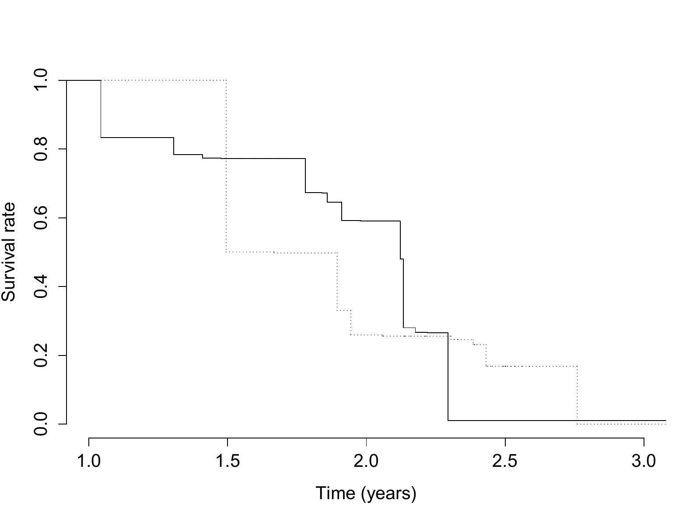

## 4.1 Nonparametric likelihood with coarsened observations {#section-1}

EM is a principle for organizing a likelihood calculation, not a method restricted to finite-dimensional models. This chapter develops three extensions. Nonparametric EM estimates a distribution from coarsened observations. Supplemented EM uses the local behavior of the iteration to estimate information. ECM simplifies a difficult maximization by dividing it into conditional maximizations over parameter blocks.

The nonparametric case begins with a distinction between a density and a probability distribution. Unrestricted density maximization can concentrate arbitrarily high spikes at observed values. Maximizing probability masses on an appropriate support is a different, well-defined likelihood problem and leads to the empirical distribution in the fully observed case.

The likelihood principle behind EM does not require a finite-dimensional model. To see how it extends to distribution estimation, let $Y_1,\ldots,Y_n$ be an independent sample from an unknown cumulative distribution function $F$. A parametric model restricts $F$ to a family $F_\theta$, with density $p_Y(y;\theta)$ indexed by a finite-dimensional parameter. For example, a location-scale normal family has density $\sigma^{-1}\phi\{(y-\mu)/\sigma\}$, where $\phi$ is the standard normal density. Estimating $F$ within that family amounts to estimating $(\mu,\sigma)$. Removing the parametric restriction changes the optimization problem and requires care about what is being maximized.

:::::: math-passage
Then the inference about $F$ is essentially the same as the inference about $\theta$, which can be carried out by maximizing the (parametric) likelihood

::: math-block
$$
L(D;\theta)=\prod_{i=1}^nf(Y_i;\theta).
$$
:::

Now, suppose we do not make any parametric assumptions on $F$ and let it range over all possible (continuous) distribution functions. Denote its density by $f=F'$. Then, the likelihood becomes

::: math-block
$$
L(D;f)=\prod_{i=1}^nf(Y_i).
$$
:::

It might be tempting to define the MLE for $f$ as

::: math-block
$$
\begin{equation}\tag{4.1}\label{eq:naive_npmle}
\widehat f:=\arg\max_{f}L(D;f), \mbox{subject to }\int
f(y)dy=1.\end{equation}
$$
:::
::::::

The unrestricted density optimization in ($\ref{eq:naive_npmle}$) has no useful maximum. Only the values of the density at $Y_1,\ldots,Y_n$ enter the likelihood, so a candidate density can place increasingly high, increasingly narrow spikes at those observations while still satisfying $\int f(y)\,dy=1$. Requiring continuity does not prevent this construction. One response is to penalize roughness, for example with a term proportional to $\int f''(y)^2\,dy$, and minimize the penalized negative log likelihood (Green and Silverman, 1993). Kernel smoothing is another approach. Both introduce a choice controlling smoothness. A different route, developed next, estimates probability masses and the distribution function directly.

::::: math-passage
Alternatively, one can focus on the distribution function $F$ rather than its density, and restrict the space of $F$ to all discrete distribution functions taking jumps at the $Y_i$. So that we have a nonparametric likelihood (or empirical likelihood):

::: math-block
$$
\begin{equation}\tag{4.2}\label{eq:nplike}
L(D;F)=\prod_{i=1}^nF\{Y_i\},\end{equation}
$$
:::

where $F\{y\}=\operatorname{Pr}(Y=y)$. Suppose $y_{(1)}<\cdots<y_{(m)}$ are the ordered distinct values of the $Y_i$. Write $d_k=F\{y_{(k)}\}$, $k=1,\cdots, m$. Then the log-likelihood can be written as

::: math-block
$$
\begin{equation}\tag{4.3}\label{eq:np_log_lik}
\sum_{k=1}^mn_k\log d_k, \mbox{subject to
}\sum_{k=1}^md_k=1,\end{equation}
$$
:::

where $n_k$ is the number of the $Y_i$ that are equal to $y_{(k)}$, i.e., $n_k=\sum_{i=1}^n I(Y_i=y_{(k)})$.
:::::

::::: math-passage
Thus, the discretized log-likelihood take the form of a multinomial log-likelihood, and it is easy to obtain

::: math-block
$$
\widehat d_k=\frac{n_k}{n}.
$$
:::

Therefore, the nonparametric MLE (NPMLE) for $F$ is

::: math-block
$$
\widehat F(y)=\sum_{y_{(k)}\leq
y}d_k=n^{-1}\sum_{y_{(k)}\leq
y}\sum_{i=1}^nI(Y_i=y_{(k)})=n^{-1}\sum_{i=1}^nI(Y_i\leq y),
$$
:::

which is the same as the familiar "empirical distribution" function. Note back in ($\ref{eq:np_log_lik}$), the $n_k$, and thus the functions $I(Y_i\leq y)$, are sufficient statistics.
:::::

The constrained maximization follows immediately from a Lagrange multiplier. For $\sum_kn_k\log
d_k+\lambda(1-\sum_kd_k)$, the first-order equations give $n_k/d_k=\lambda$. Summing $d_k=n_k/\lambda$ over $k$ yields $\lambda=n$. The result $\widehat d_k=n_k/n$ is exactly the empirical distribution. With coarsened data, the counts $n_k$ are replaced by conditional expected counts, reproducing the EM pattern from the multinomial examples.

## 4.2 Right censoring and self-consistency {#section-2}

Censoring records a set of possible values rather than a single value. For a right-censored subject, the event time is known to exceed the censoring time. Independent censoring permits the censoring mechanism to factor out of inference for the event-time distribution. This does not mean that censored subjects are uninformative: their survival beyond a known time contributes to the likelihood.

:::: math-passage
Univariate coarsened data usually takes the form of censoring (Cox, 1972), which often occurs in medical studies where subjects are followed to register the time to certain event, e.g., death, onset of disease, and etc. Because the patient cannot be followed indefinitely till the event occurs, at some point in time the study will be terminated, and those without having the event during follow-up are said to be (right) censored. Let $Y$ denote the event time and $C$ denote the study end time, then the observed data consists of $(\delta, Y\wedge C)$, where $\delta=I(Y\leq C)$ and $a\wedge b=\min(a,b)$. In missing data terminology, the coarsening rule is

::: math-block
$$
Y\to
\left\{\begin{array}{ll}Y,&\mbox{ if }\delta=1\\
(C,\{Y>C\}), &\mbox{ if }\delta=0.\end{array}\right.
$$
:::
::::

:::: math-passage
One can show that when $C\perp\!\!\!\perp
Y$, this coarsening rule is at random (MAR). So that the MLE based on the observed data leads to valid inference on the distribution of $Y$. Because of the independent censoring assumption, all inference can be conditioned upon the censoring times. So, for simplicity, we treat the censoring times as fixed, and use small letter $c$ to denote their values. The observed data likelihood based on $(\delta_i, Y_i\wedge c_i)$, $i=1,\cdots, n$, is

::: math-block
$$
\prod_{i=1}^nF\{Y_i\}^{\delta_i}\{1-F(c_i)\}^{1-\delta_i}.
$$
:::

The best known estimator for $F$ in the right censored data is the Kaplan Meier estimator (Kaplan and Meier, 1958), which can shown to be equivalent to the NPMLE.
::::

:::: math-passage
Alternatively, we can use the EM algorithm to compute the NPMLE based on the uncensored full data $Y_i$. Specifically, by inspecting the observed-data likelihood, we see that we need to discretize $F$ at the those $Y_i$ with $\delta_i=1$. Suppose $y_{(1)}<\cdots<y_{(m)}$ are the ordered distinct values of the $Y_i$ with $\delta_i=1$. Write $d_k=F\{y_{(k)}\}$, $k=1,\cdots, m$. Now our aim is to estimate the $d_k$. Recall that the full data MLE gives that $\widehat
d_k=n^{-1}\sum_{i=1}^nI(Y_i=y_{(k)})$ and that the $I(Y_i=y_{(k)})$ is the sufficient statistic. Hence the M step at the $(j+1)$th iteration is given by

::: math-block
$$
d_k^{(j+1)}=n^{-1}\sum_{i=1}^nE[I(Y_i=y_{(k)})\mid
\delta_i,Y_i\wedge c_i;F^{(j)}].
$$
:::
::::

:::::: math-passage
To evaluate the expected counts, consider separately an exact observation and a censored observation. An exact event time determines whether the subject belongs to support point $y_{(k)}$:

::: math-block
$$
E[I(Y_i=y_{(k)})\mid \delta_i=1,Y_i\wedge
c_i]=I(Y_i=y_{(k)}),
$$
:::

A censored event time must instead be allocated across the support points beyond the censoring time:

::: math-block
$$
\begin{aligned}
E[I(Y_i=y_{(k)})|\delta_i=0,Y_i\wedge c_i]&=E[I(Y_i=y_{(k)})|Y_i>
c_i]\\
&=I(c_i<y_{(k)})\frac{d_k^{(j)}}{1-F^{(j)}(c_i)},
\end{aligned}
$$
:::

Here $F^{(j)}(y)=\sum_{y_{(k)}\leq y}d_k^{(j)}$ is the current fitted distribution function. Combining the two cases and averaging the conditional allocations gives the update

::: math-block
$$
\begin{equation}\tag{4.4}\label{eq:e_step_rc}
d_k^{(j+1)}=n^{-1}\sum_{i=1}^n\left\{\delta_iI(Y_i=y_{(k)})+(1-\delta_i)I(c_i<y_{(k)})\frac{d_k^{(j)}}{\sum_{y_{(l)}>c_i}d_l^{(j)}}\right\}.\end{equation}
$$
:::

Each subject contributes a total mass of one, distributed only over values compatible with that subject's observation. This mass-allocation interpretation makes the connection with the grouped-multinomial E step explicit.
::::::

:::: math-passage
An alternative "functional" form of the iteration can be derived as follows. Note that by the form of full-data NPMLE, we have

::: math-block
$$
\begin{aligned}
F^{(j+1)}(y)&=n^{-1}\sum_{i=1}^nE[I(Y_i\leq y)\mid
\delta_i,Y_i\wedge c_i;F^{(j)}]\\
&=n^{-1}\sum_{i=1}^n\left\{\delta_iI(Y_i\leq
y)+(1-\delta_i)I(c_i<y)\frac{F^{(j)}(y)-F^{(j)}(c_i)}{1-F^{(j)}(c_i)}\right\}.
\end{aligned}
$$
:::

Clearly, this is equivalent to ($\ref{eq:e_step_rc}$), which is more useful in actual implementation of the algorithm.
::::

### Support at the tail and the Kaplan--Meier connection

If the largest follow-up is censored, support only at observed event times is insufficient. Retain an additional tail mass beyond the last observed time, commonly represented at $+\infty$. Otherwise some censored records have no compatible support point and the E-step denominator becomes zero. The mass-allocation equations remain valid when this extra support point is included.

:::: math-passage
The product-limit estimator can also be obtained by parameterizing with event hazards. At distinct event times $t_k$, let $d_k$ be the number of events and $r_k$ the number at risk. The event-time likelihood factors into terms $h_k^{d_k}(1-h_k)^{r_k-d_k}$. Thus $\widehat h_k=d_k/r_k$ and

::: math-block
$$
\widehat S(t)=\prod_{t_k\le
t}\left(1-\frac{d_k}{r_k}\right),\qquad \widehat F(t)=1-\widehat
S(t).
$$
:::

Self-consistent redistribution of censored mass leads to the same fitted survival probabilities. The unresolved tail explains why the estimated survival curve need not reach zero.
::::

## 4.3 Interval censoring {#section-3}

Current-status data contain less information than right-censored data: neither a positive nor a negative test gives an exact event time. The likelihood is Bernoulli in the values $F(u_i)$, subject to their being nondecreasing. Tied examination times must be handled jointly. The interpretation as interval censoring makes the EM calculation particularly direct: distribute each subject's unit mass across support points inside that subject's compatible interval.

:::: math-passage
Interval censoring arises when the event is detected at an examination rather than recorded at its exact occurrence. With one examination per subject, the resulting observations are called current-status data. Let $Y_i$ be the latent event time, $u_i$ the examination time, and $\delta_i=I(Y_i\leq
u_i)$ the indicator that the event has already occurred. The recorded sample is

::: math-block
$$
(\delta_i, u_i),
\,\,\,i=1,\cdots,n.
$$
:::

A positive examination locates the event at or before $u_i$, while a negative examination locates it after $u_i$. Neither outcome supplies an exact event time, which is the principal difference from the right-censoring setting above.
::::

:::: math-passage
The observed data likelihood is

::: math-block
$$
\prod_{i=1}^nF(u_i)^{\delta_i}\{1-F(u_i)\}^{1-\delta_i}.
$$
:::

Note that the likelihood needs no "discretization" as it contains no density function. This is the result of the $Y_i$ being never exactly observed. Also note that the likelihood depends on $F$ only through the $F(u_i)$. Write $u_{(1)}<\cdots<u_{(m)}$ as the distinct ordered values of the $u_i$. Then, the function $F$ should satisfy the monotonicity constraint $0\leq
F(u_{(1)})\leq\cdots\leq F(u_{(m)})\leq 1$, or, $F(u_{(k)})-F(u_{(k-1)})\geq 0$, $k=1,\cdots,m,m+1$, where $u_{(0)}=0$ and $u_{(m+1)}=\infty$. At those $u_{(k)}$ at which all tied examinations have $\delta_i=0$, increasing $F(u_{(k)})$ serves only to decrease to likelihood. So from the MLE perspective, we must have $F(u_{(k)})=F(u_{(k-1)})$.
::::

:::: math-passage
So we might as well re-define $u_{(1)}<\cdots<u_{(m)}$ as the distinct ordered values of the $u_i$ with $\delta_i=1$. A direct approach to computing the NPMLE based on the observed-data likelihood is to treat it as an isotonotic regression problem (Greeneboom and Wellner, 1992). Here we use the EM based on the full data. Because we can only "identify" $F$ at $u_{(1)}, \cdots, u_{(m)}$, the distribution of the probability mass $d_k:=F(u_{(k)})-F(u_{(k-1)})$ on $(u_{(k-1)},u_{(k)}]$ is irrelevant. For simplicity, we put it on the right end. That is, we let $d_k={\Pr}(Y=u_{(k)})$. Similar to the right-censored data, the M step at the $(j+1)$th iteration is given by

::: math-block
$$
d_k^{(j+1)}=n^{-1}\sum_{i=1}^nE[I(Y_i=u_{(k)})\mid
\delta_i,u_i;F^{(j)}].
$$
:::
::::

:::::: math-passage
For the E step, we have that

::: math-block
$$
E[I(Y_i=u_{(k)})\mid
\delta_i=1,u_i;F^{(j)}]=I(u_i\geq
u_{(k)})\frac{d_k^{(j)}}{F^{(j)}(u_i)},
$$
:::

and

::: math-block
$$
E[I(Y_i=u_{(k)})\mid
\delta_i=0,u_i;F^{(j)}]=I(u_i<u_{(k)})\frac{d_k^{(j)}}{1-F^{(j)}(u_i)}.
$$
:::

Hence,

::: math-block
$$
\begin{aligned}
d_k^{(j+1)}&=n^{-1}\sum_{i=1}^n\Bigg\{\delta_iI(u_i\geq
u_{(k)})\frac{d_k^{(j)}}{F^{(j)}(u_i)}\\
&
+(1-\delta_i)I(u_i<u_{(k)})\frac{d_k^{(j)}}{1-F^{(j)}(u_i)}\Bigg\}.
\end{aligned}
$$
:::
::::::

:::: math-passage
Similarly, for a functional form of the EM, we have that

::: math-block
$$
F^{(j+1)}(y)=\frac1n\sum_i\left\{\delta_i\frac{F^{(j)}(\min(y,u_i))}{F^{(j)}(u_i)}+(1-\delta_i)I(y>u_i)\frac{F^{(j)}(y)-F^{(j)}(u_i)}{1-F^{(j)}(u_i)}\right\}.
$$
:::

The algorithm can be generalized to arbitrary interval-censored data arising from multiple periodic tests . Suppose $Y_i$ is interval censored such that we only know that it lies between an interval $(l_i,r_i]$. (In the current status case, if $\delta_i=1$, then $l_i=0$ and $r_i=u_i$; if $\delta_i=0$, then $l_i=u_i$ and $r_i=\infty$).
::::

:::: math-passage
Then, a similar derivation shows that the EM step for the NPMLE is given by

::: math-block
$$
F^{(j+1)}(y)=n^{-1}\sum_{i=1}^n
\frac{F^{(j)}(y\wedge r_i)-F^{(j)}(y\wedge
l_i)}{F^{(j)}(r_i)-F^{(j)}(l_i)}.
$$
:::

One can similarly derive a corresponding "algebraic form".
::::

### Deriving the interval allocation and functional update

:::: math-passage
Use intervals $(l_i,r_i]$, with endpoint conventions matching the observation process. For support points $t_k$, define $A_{ik}=I(l_i<t_k\le r_i)$. The posterior mass and update are

::: math-block
$$
w_{ik}^{(j)}=\frac{A_{ik}d_k^{(j)}}{\sum_l
A_{il}d_l^{(j)}},\qquad
d_k^{(j+1)}=n^{-1}\sum_iw_{ik}^{(j)}.
$$
:::

Summing over $t_k\le y$ gives the corresponding update of the distribution function. It is simply $E\{I(Y_i\le y)\mid l_i<Y_i\le r_i\}$ averaged over subjects.
::::

:::: math-passage
For current status, the correct specialization is

::: math-block
$$
F^{(j+1)}(y)=\frac1n\sum_i\left[
\delta_i\frac{F^{(j)}(\min(y,u_i))}{F^{(j)}(u_i)}
+(1-\delta_i)I(y>u_i)\frac{F^{(j)}(y)-F^{(j)}(u_i)}{1-F^{(j)}(u_i)}
\right].
$$
:::

For a positive test, the conditional probability becomes one when $y\ge u_i$; for a negative test it is zero when $y\le
u_i$. These endpoint checks also provide a quick way to verify the update. Every observed interval must receive positive probability at initialization.
::::

At a tied examination time with both positive and negative tests, one cannot conclude that the fitted distribution has no jump merely because one test is negative. The likelihood uses the aggregated counts at that time. Pool-adjacent-violators methods solve the monotonicity-constrained Bernoulli problem directly and provide a useful independent check on the EM fit.

## 4.4 A mouse tumorigenicity study {#section-4}

In the mouse study the event of interest is tumor onset, while the examination occurs at sacrifice. A detected tumor implies onset before examination; absence implies onset later. The curves below therefore summarize estimated onset-time distributions under the examination assumptions, rather than empirical distributions of recorded onset times. The distinction between the event and its detection is central to the analysis.

Consider an example from a tumorigenicity study described in Hoel and Walburg (1972). One hundred and forty-four RFM mice were assigned to either a germ-free or a conventional environment, and were sacrificed after several years to detect the presence of lung tumor. The purpose of this study is to compare the time from beginning of the study until the time to observe a tumor. Since lung tumors are nonlethal and cannot be observed before death in RFM mice, it is appropriate to treat this data as current status data. We use the EM algorithm to estimate the survival functions for the two groups of mice separately.

::::: book-figure

::: {#fig:c_status}
:::

::: figure-caption
Nonparametric maximum likelihood estimates for the survival functions for tumor occurence in mice. Solid: germ-free; dotted: conventional.
:::
:::::

## 4.5 Supplemented EM and missing information {#section-5}

Slow EM convergence and missing information are connected. If the observed data reveal nearly all the complete-data information, the conditional reconstruction changes little with the current parameter and the update quickly forgets its starting value. If much information is missing, the update depends strongly on the current parameter and can move slowly. SEM turns this local dependence into an information calculation.

For variance calculation, the Louis formula is a convenient method for models with fair complexity. However, the method involves extra analytical calculations that may not be feasible for more complex problems. Meng and Rubin (1991) proposed a supplemented EM algorithm (SEM) that provides a numerical approximation to the information as a bi-product of the EM calculations themselves. This approach is based on the derivative of the mapping defined by the iterations of the EM algorithm.

To fix matrix orientation, let $J$ be the usual column Jacobian with $J_{ab}=\partial\mathcal
M_a/\partial\theta_b$, and write $J_{\mathrm{row}}=J^{\mathrm{T}}$. We use the row convention for the finite-difference formulas below. Let $I_c=-Q_{11}$ be conditional expected complete-data information, and $I_m$ missing information, all evaluated at the fitted fixed point.

:::::: math-passage
Define $\mathcal M(\theta)$ to be the value of $\theta^*$ that maximizes $Q(\theta^*\mid \theta)$, i.e.,

::: math-block
$$
\mathcal
M(\theta)=\arg\max_{\theta^*} Q(\theta^*\mid \theta).
$$
:::

Dempster, Laird and Rubin (1977) observed that this the derivative of $\mathcal M(\theta)$ satisfies

::: math-block
$$
\begin{equation}\tag{4.5}\label{eq:sem}
J_{\mathrm{row}}=
-\frac{\partial^2H(\theta|\widehat\theta)}{\partial\theta^{\otimes
2}}\Bigg|_{\theta=\widehat\theta}\left\{-\frac{\partial^2Q(\theta|\widehat\theta)}{\partial\theta^{\otimes
2}}\Bigg|_{\theta=\widehat\theta}\right\}^{-1},\end{equation}
$$
:::

where

::: math-block
$$
\frac{\partial^2H(\theta|\widehat\theta)}{\partial\theta^{\otimes
2}}=E\left[\frac{\partial^2}{\partial\theta^{\otimes 2}}\log
L(D_{\mathrm{mis}}|D_{\mathrm{obs}};\theta)\Big|D_{\mathrm{obs}};\widehat\theta\right].
$$
:::

A derivation of ($\ref{eq:sem}$) is given below.
::::::

:::::: math-passage
Recall from §2 that

::: math-block
$$
-\frac{\partial^2Q(\theta|\widehat\theta)}{\partial\theta^{\otimes
2}}\Bigg|_{\theta=\widehat\theta}=I(D;\widehat\theta)
$$
:::

represents conditional expected complete-data information given the observed records and

::: math-block
$$
-\frac{\partial^2H(\theta|\widehat\theta)}{\partial\theta^{\otimes
2}}|_{\theta=\widehat\theta}
$$
:::

is the missing data information. By the missing-information identity, we have that

::: math-block
$$
\begin{aligned}
I(D_{\mathrm{obs}};\widehat\theta)&=-\frac{\partial^2Q(\theta|\widehat\theta)}{\partial\theta^{\otimes
2}}\Bigg|_{\theta=\widehat\theta}+\frac{\partial^2H(\theta|\widehat\theta)}{\partial\theta^{\otimes
2}}\Bigg|_{\theta=\widehat\theta}\\
&=\left\{I-J_{\mathrm{row}}\right\}\left\{-\frac{\partial^2Q(\theta|\widehat\theta)}{\partial\theta^{\otimes
2}}\Bigg|_{\theta=\widehat\theta}\right\},
\end{aligned}
$$
:::

where $I$ is the identity matrix.
::::::

:::::: math-passage
Thus if $J_{\mathrm{row}}$ can be estimated and

::: math-block
$$
-\frac{\partial^2Q(\theta|\widehat\theta)}{\partial\theta^{\otimes
2}}|_{\theta=\widehat\theta}
$$
:::

computed, then the observed information can be estimated without further computation. In the SEM algorithm, the derivatives in $J_{\mathrm{row}}$ are approximated with numerical differences. Specifically, set $\theta(k) =
(\widehat\theta_1,\cdots,\widehat\theta_{k-1},\theta_k,\widehat\theta_{k+1},\cdots,\widehat\theta_p)^{\mathrm{T}}$, where $\theta_k$ is some value close to $\widehat\theta_k$. Use the M step of the EM algorithm to compute $\mathcal
M(\theta(k))$, that is,

::: math-block
$$
\mathcal
M(\theta(k))=\arg\max_{\theta^*} Q(\theta^*\mid \theta(k)).
$$
:::

Then, approximate the $k$th component of $J_{\mathrm{row}}$ by

::: math-block
$$
\frac{\mathcal M(\theta(k))^{\mathrm{T}}-\mathcal
M(\widehat\theta)^{\mathrm{T}}}{\theta_k-\widehat\theta_k}.
$$
:::
::::::

Since at the exact solution,$\mathcal
M(\widehat\theta)=\widehat\theta$, this substitution could also be made in the previous expression. However, as Gray (2002) noted, usually the EM algorithm is terminated a little short of the exact maximizer, so $\mathcal
M(\widehat\theta)$ will not be exactly equal to $\widehat\theta$, and a small difference between $\mathcal M(\widehat\theta)$ and $\widehat\theta$ can affect the accuracy of the results.

:::: math-passage
The remaining question is how to choose $\theta\equiv(\theta_1,\cdots,\theta_p)^{\mathrm{T}}$ for the differences. Numerical differences as approximations to derivatives can be quite sensitive to the size of the difference used. Meng and Rubin (1991) proposed using some $\theta^{(j_0)}$ along the way of the EM iterations. That is, the $k$th component of $J_{\mathrm{row}}$ is approximated by

::: math-block
$$
\frac{\mathcal
M(\theta^{(j_0)}(k))^{\mathrm{T}}-\mathcal
M(\widehat\theta)^{\mathrm{T}}}{\theta^{(j_0)}_k-\widehat\theta_k},
$$
:::

where $\theta^{(j_0)}(k) =
(\widehat\theta_1,\cdots,\widehat\theta_{k-1},\theta^{(j_0)}_k,\widehat\theta_{k+1},\cdots,\widehat\theta_p)^{\mathrm{T}}$.
::::

### Deriving the SEM identity

::::: math-passage
The M step satisfies $Q_1(\mathcal
M(\theta),\theta)=0$, where subscript one differentiates the candidate parameter and subscript two the conditioning parameter. Differentiating this identity gives

::: math-block
$$
Q_{11}J+Q_{12}=0.
$$
:::

At the fixed point $Q_{11}=-I_c$ and $Q_{12}=I_m$, so $J=I_c^{-1}I_m$. Therefore

::: math-block
$$
I_o=I_c-I_m=I_c(I-J)=(I-J^{\mathrm{T}})I_c.
$$
:::

This establishes the information identity with the stated matrix convention. The covariance is $I_o^{-1}=(I-J)^{-1}I_c^{-1}$ when these matrices are nonsingular.
:::::

:::: math-passage
Numerical derivatives can use centered differences,

::: math-block
$$
J_{\cdot k}\approx\frac{\mathcal
M(\widehat\theta+he_k)-\mathcal M(\widehat\theta-he_k)}{2h}.
$$
:::

Check several step sizes and tighter EM tolerances; taking $h$ extremely small can amplify rounding and optimization error. Substantial asymmetry in the resulting observed-information estimate is a useful diagnostic rather than something to conceal automatically.
::::

## 4.6 Expectation/conditional maximization {#section-6}

The ascent proof in Chapter 2 required an increase in $Q$, not an exact joint maximizer. ECM uses that flexibility constructively. The E step is held fixed while a sequence of simpler conditional maximizations raises the same objective. The word "conditional" refers to parameters held fixed, and does not denote a conditional-data likelihood.

In many applications, the M step is difficult and would require iterative search methods for finding the maximum. Recall from §2.1 though that generally it is not necessary to find the exact maximum in the M step for the EM algorithm to result in a monotonic increase of observed data log-likelihood. In applications where iterative search methods are needed, sometimes subsets of the parameters can be maximized much more easily than the full parameter vector. Suppose that $\theta=(\theta_1,\theta_2)$, and that $Q(\theta_1,\theta_2\mid
\theta_1^{(j)},\theta_2^{(j)})$ is easy to maximize over either $\theta_1$ or $\theta_2$ with the other held fixed, but that jointly maximizing over both is more difficult.

In these settings Meng and Rubin (1993) proposed using a generalization of the EM algorithm called the Expectation/Conditional Maximization (ECM) algorithm. Given the parameter values from the previous iteration (or the initial values), the algorithm proceeds by computing $Q(\theta_1,\theta_2\mid
\theta_1^{(j)},\theta_2^{(j)})$ in the E-step as before. Next, $Q(\theta_1,\theta_2^{(j)}\mid
\theta_1^{(j)},\theta_2^{(j)})$ is maximized over $\theta_1$ to obtain $\theta_1^{(j+1)}$. Then $Q(\theta_1^{(j+1)},\theta_2\mid
\theta_1^{(j)},\theta_2^{(j)})$ is maximized over $\theta_2$ to obtain $\theta_2^{(j+1)}$. Then the algorithm returns to the E-step, computing the expectation at the new parameter values $(\theta_1^{(j+1)},\theta_2^{(j+1)})$, with the steps repeated until convergence.

:::: math-passage
By definition,

::: math-block
$$
\begin{aligned}
Q(\theta_1^{(j+1)},\theta_2^{(j+1)}|\theta_1^{(j)},\theta_2^{(j)})&\geq
Q(\theta_1^{(j+1)},\theta_2^{(j)}|\theta_1^{(j)},\theta_2^{(j)})\\
&\geq
Q(\theta_1^{(j)},\theta_2^{(j)}|\theta_1^{(j)},\theta_2^{(j)}).
\end{aligned}
$$
:::

So, by the proof of Proposition 2.2, the observed-data log-likelihood is always increasing. The two maximizations within the M step could be iterated, to get improved M-step estimates before returning to the next E-step (often such iteration would converge to the joint maximizers of $Q(\theta_1,\theta_2\mid
\theta_1^{(j)},\theta_2^{(j)})$, in which case this algorithm would be an EM algorithm with a special type of computations in the M step). However, since the EM algorithm often requires many iterations through both the E and M steps, there is often little advantage to further iteration within each M step.
::::

The phrase "conditional maximization" in ECM is used to denote the process of maximizing over a subset of the parameters with the other parameters held fixed. Note that it should not be misunderstood as maximizing the likelihood for a conditional distribution. All that is meant by "conditional" is fixing the values of a subset of the parameters. The algorithm as described above has an obvious generalization to settings where there are three or more different subsets of parameters, each of which is easy to maximize when the others are held fixed.

## 4.7 Multivariate normal regression {#section-7}

The normal regression example makes this separation explicit. Conditional moments of the incomplete responses supply an expected residual sum-of-squares matrix. For a fixed covariance, the regression update is generalized least squares. For fixed regression coefficients, the covariance update is an average expected residual outer product. Each operation has a closed form even when their joint maximization does not.

:::: math-passage
Suppose the complete data response vectors $Y_i$ are independent with

::: math-block
$$
Y_i\mid Z_i\sim N(Z_i\beta,V),  i=1,\cdots,
n,
$$
:::

where $Y_{i1},\cdots,
Y_{ik}$, $Z_i$ is a $k\times p$ matrix of covariates (usually including a constant term), $\beta$ is a $p$-vector of unknown parameters, and the covariance matrix $V$ is only required to be positive definite (which means it has $k(k +
1)/2$ unknown parameters). Suppose that $Y_i$ is incomplete for some cases. For example, the components of $Y_i$ could be longitudinal measurements, and some subjects may drop out before completing all measurements. But missinness could also be nonmonotone (see §3.4). The missingness mechanism is assumed to be MAR.
::::

::::: math-passage
Let $\theta=(\beta,V)$. The full-data log-likelihood is

::: math-block
$$
\begin{aligned}
l_n(D;\theta)&=-\frac{n}{2}\log\det
V-\frac{1}{2}\sum_{i=1}^n(Y_i-Z_i\beta)^{\mathrm{T}}V^{-1}(Y_i-Z_i\beta)\\
&=-\frac{n}{2}\log\det V-\frac{1}{2}{\rm
tr}\left(\sum_{i=1}^n(Y_i-Z_i\beta)^{\otimes 2}V^{-1}\right).
\end{aligned}
$$
:::

Denote the observed response vector for the $i$th subject as $M_i(Y_i)$. The E step at the $(j+1)$th iteration computes

::: math-block
$$
Q(\beta,V\mid \theta^{(j)})=-\frac{n}{2}\log\det
V-\frac{1}{2}{\rm tr}\left(\sum_{i=1}^n\Big(\widehat C_i^{(j)}+(\widehat
Y_i^{(j)}-Z_i\beta)^{\otimes 2}\Big)V^{-1}\right),
$$
:::
:::::

:::: math-passage
where $\widehat Y_i^{(j)}=E[Y_i\mid
M_i(Y_i),Z_i;\theta^{(j)}]$, and $\widehat C_i^{(j)}=\operatorname{Var}[Y_i\mid
M_i(Y_i),Z_i;\theta^{(j)}]$. Maximization of $Q(\beta,V\mid \theta^{(j)})$ jointly over $\beta$ and $V$ is hard, generally requiring iterative methods. However, it is easy to maximize $Q(\beta,V\mid \theta^{(j)})$ over $\beta$ for fixed $V$, and *vice versa*, using standard techniques. So, the conditional maximization proceeds as follows. First

::: math-block
$$
\begin{aligned}
\beta^{(j+1)}&=\arg\max_\beta Q(\beta,V^{(j)}\mid \theta^{(j)})\\
&=\left(\sum_{i=1}^nZ_i^{\mathrm{T}}{V^{(j)}}^{-1}Z_i\right)^{-1}\sum_{i=1}^nZ_i^{\mathrm{T}}{V^{(j)}}^{-1}\widehat
Y_i^{(j)}.
\end{aligned}
$$
:::
::::

:::: math-passage
This gives

::: math-block
$$
\begin{aligned}
V^{(j+1)}&=\arg\max_V Q(\beta^{(j+1)},V\mid \theta^{(j)})\\
&=n^{-1}\sum_{i=1}^n\Big(\widehat C_i^{(j)}+(\widehat
Y_i^{(j)}-Z_i\beta^{(j+1)})^{\otimes 2}\Big).
\end{aligned}
$$
:::

Although joint maximizers are not computed at each iteration, generally this algorithm will still converge to the maximizers of the observed-data likelihood. On the other hand, direct maximization of the observed-data likelihood would require an iterative search with possibly lots of determinant and matrix inversion calculations within each step.
::::

The covariance correction $\widehat
C_i$ is essential here for the same reason it was essential in Chapter 2: replacing missing responses by conditional means alone loses the conditional variance. All conditional moments remain those from the beginning of the ECM iteration while both parameter blocks are updated. Refreshing the E step between blocks defines a different algorithm and requires its own ascent argument.

## 4.8 What EM does and does not guarantee {#section-8}

The EM algorithm provides a convenient framework to approach estimation in incomplete data problems. It is widely used in the statistical literature, and there are many other extensions and variations than those discussed above. For example, Liu and Rubin (1994) extend the ECM algorithm to an ECME algorithm, where in some of the sub-steps the observed-data likelihood is directly maximized over a subset of the parameters. Other extensions are discussed in Meng and van Dyk (1997).

The EM algorithm is most useful when

1.  Computing the conditional expectation of the full-data log-likelihood is easier than directly computing the observed-data likelihood;

2.  Maximizing $Q(\theta\mid
    \theta^{(j)})$, or at least finding sufficiently improved values of $\theta$ through the ECM algorithm or other means, is sufficiently fast.

Since the EM algorithm usually converges at a fairly slow rate (linear as opposed to the quadratic rate of Newton-Raphson), individual iterations have to be fast or it will not be competitive with directly maximizing the observed data likelihood. Another important reason for using the EM algorithm is to compute MLEs from incomplete data using available software for fitting full data.

As has been seen in the foregoing chapters, in many problems the M step involves full-data estimates computed based on modified weights. So, provided the E step calculations can be programmed, it is then often straightforward to compute the steps in the EM algorithm without much additional work. Admittedly, in some (probably many) incomplete data problems, the EM algorithm is less advantageous as compared to the competing methods such as multiple imputation and Bayesian inference, particularly when the E step is hard to program and requires Monte-Carlo integration. However, the framework of EM is still attractive in that it is built under a strictly frequentist paradigm.

The choice among EM variants is a computational decision after the observed-data model has been specified. Evaluate total work, numerical stability, and the uncertainty calculation, not only the number of iterations. An exact EM sequence is monotone in likelihood; a Monte Carlo approximation need not be. A stationary point need not be a global maximum. A converged calculation cannot resolve nonidentifiability. Keeping these distinctions separate makes the algorithm useful without assigning it guarantees it does not provide.

## 4.9 References {#section-9}

Cox, D. R. (1972). Regression models and life tables (with discussion). Journal of the Royal Statistical Society: Series B, 34, 187-220.

Dempster, A. P., Laird, N. M., and Rubin, D. B. (1977). Maximum likelihood from incomplete data via the EM algorithm. Journal of the Royal Statistical Society, Series B, 1-38.

Green, P. J. and Silverman, B. W. (1993). Nonparametric regression and generalized linear models: a roughness penalty approach. CRC Press.

Groeneboom, P. and Wellner, J. A. (1992). Information bounds and nonparametric maximum likelihood estimation. New York: Springer.

Hoel, D. G. and Walburg, H. E. (1972). Statistical analysis of survival experiments. Journal of the National Cancer Institute, 49, 361-372.

Kaplan, E. L. andMeier, P. (1958). Nonparametric estimation from incomplete observations. Journal of the American Statistical Association, 53, 457-481.

Liu, C. and Rubin, D. B. (1994). The ECME algorithm: a simple extension of EM and ECM with faster monotone convergence. Biometrika, 633-648.

Meng, X. L. andRubin, D. B. (1991). Using EM to obtain asymptotic variance-covariance matrices: The SEM algorithm. Journal of the American Statistical Association, 86, 899-909.

Meng, X. L. and Rubin, D. B. (1993). Maximum likelihood estimation via the ECM algorithm: A general framework. Biometrika, 80, 267-278.

Meng, X. L. and Van Dyk, D. (1997). The EM Algorithm: an Old Folk‐song Sung to a Fast New Tune. Journal of the Royal Statistical Society: Series B, 59, 511-567.
